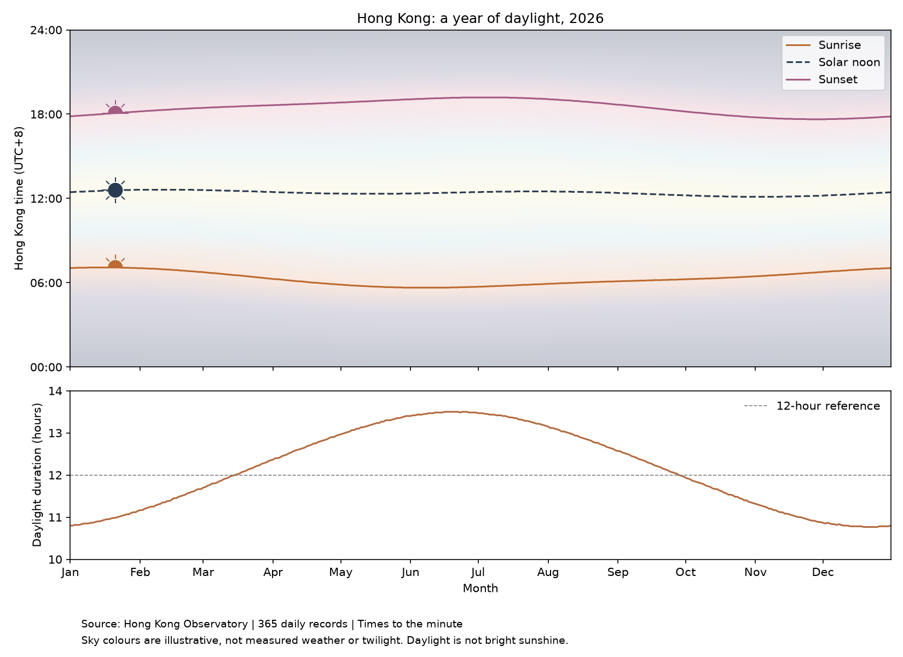

# A Year of Daylight in Hong Kong

<!-- This is the SD5913 assignment 2 template. Everything in this file is yours to
replace, and the check counts words: comments like this one are not words, so
delete each one as you write. Start with the heading: name the phenomenon.

Then, in this order, at least 150 words in total.

New to folders, paths, or the files here whose names start with a dot? Read
https://github.com/sd5913/pfad/blob/2026/reference/files.md first. Ten minutes. -->



## The phenomenon

This project explores how daylight duration changes in Hong Kong throughout 2026. The question is how long the interval between sunrise and sunset lasts each day, and how much it varies across the year. I chose daylight as the subject and want to explore how a clear chart can be developed into a more expressive visual presentation.

## The source

The data comes from the [Hong Kong Observatory’s 2026 sunrise, sun transit and sunset dataset](https://data.gov.hk/en-data/dataset/hk-hko-rss-times-of-sunrise-suntransit-sunset/resource/65e96ebd-956c-492e-9152-080422764487).

The original CSV was downloaded on 29 September 2026 and saved unchanged in `data/hko-sunrise-sunset-2026.csv`.

It contains 365 daily records covering 1 January to 31 December 2026. Each row gives the date, sunrise, solar transit and sunset. Times use Hong Kong time (UTC+8) and are recorded to the minute.

The program converts sunrise and sunset to minutes, subtracts sunrise from sunset, and divides the result by 60 to calculate daylight duration in hours. The plotting script reads the saved CSV rather than downloading the data again.

## What the picture shows

The upper panel shows daily sunrise, solar noon and sunset in Hong Kong time, with an illustrative sky gradient following those times. The lower panel shows daylight duration, ranging from 10 hours 46 minutes to 13 hours 30 minutes.

The colours do not represent measured sky conditions, sunshine intensity or calculated twilight boundaries, and the figure does not account for buildings or terrain blocking the Sun.

## Current stage

The third version adds sun icons and a soft sky gradient while retaining the two-panel layout. I kept the opacity at 0.25 and chose pale gold rather than pale blue around solar noon.

The icons identify the three solar-time curves; their positions near the left side do not mark special dates. The next step is to review readability and verify that the project can be reproduced.

## Run it

```bash
uv run plot.py
```
